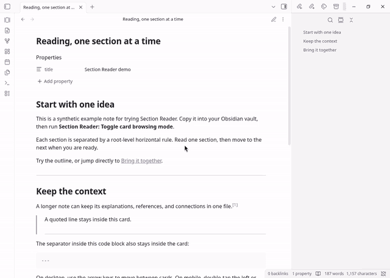
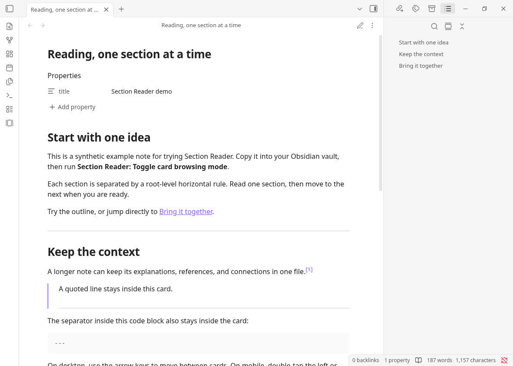
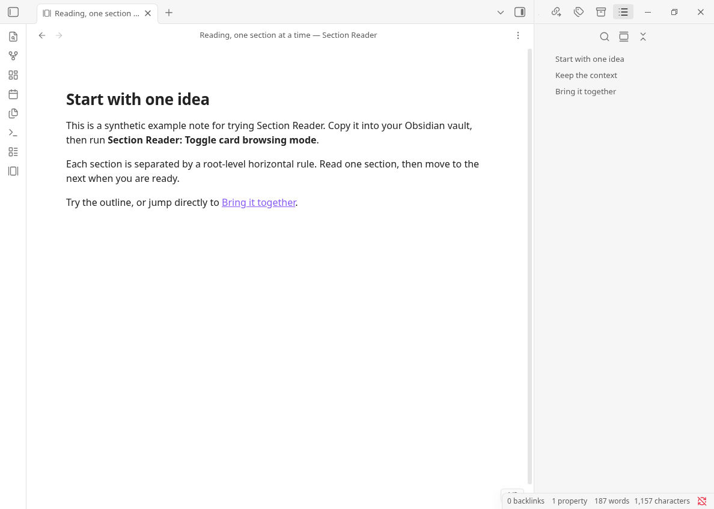

<h1 align="center">Section Reader</h1>

<p align="center">
  <a href="README.md">English</a> ·
  <a href="#31-安装">安装</a> ·
  <a href="#32-使用">开始使用</a>
</p>

> 逐段阅读和编辑长笔记，无需拆分文件。

Section Reader 在 Obsidian 原生 Markdown 视图上叠加分节聚焦：根层级 `---` 分隔的内容一次显示一节，完整笔记仍保存在原文件中。在设置中允许切换原生模式后，可以保持聚焦，在阅读与编辑状态（包括实时预览和源码模式）之间切换，继续使用原生链接、嵌入、任务交互与阅读进度。浏览本身不修改 Markdown；编辑和任务复选框操作由 Obsidian 原生保存。

需要 **Obsidian 1.8.7 或更新版本**，面向桌面端与移动端。

## 一、实际效果



按 **Ctrl + Alt + U** → 切换为逐段阅读 → 使用 **→ / ←** 前后翻页。按键标识对应录制时实际按下的键。这段录制展示 0.2.x 的阅读流程；0.3.0 还支持分节编辑。

> [!NOTE]
> **Ctrl + Alt + U 仅为本演示设置的自定义快捷键。** Section Reader 默认不分配切换快捷键，可在“设置 → 快捷键”中自行绑定。

<details>
<summary>对比原笔记与单段视图</summary>

**原笔记：** 多个段落连续显示在普通阅读视图中。



**Section Reader：** 一次只显示一段，右侧大纲仍然可用。



</details>

## 二、为什么使用它？

- **专注当前段落。** 把长篇阅读笔记或复习资料变成逐段浏览的卡片，不必拆分成多个文件
- **留在当前节直接编辑。** 使用原生编辑器标注文本或调用 Templater 等编辑命令，再回到同一节的阅读状态
- **记住阅读位置。** 用键盘或移动端边缘双击在卡片间移动，并从笔记保存的阅读进度继续
- **保留内容之间的联系。** 通过大纲和同笔记标题、块链接跳转，继续使用 Obsidian 原生 Markdown 渲染、脚注、嵌入和任务交互

## 三、安装与使用

### 3.1 安装

#### 3.1.1 从插件商店安装

1. 打开 Obsidian 的“设置 → 第三方插件”，启用第三方插件。
2. “社区插件市场 → 浏览”，搜索 **Section Reader** 并打开插件详情。
3. 点击“安装”，安装完成后点击“启用”。

#### 3.1.2 手动安装

先选择一种方式获取安装文件：

- **下载 Release：** 前往 [Releases](https://github.com/SeraphinaGlacia/obsidian-section-reader/releases)，下载同一个 Section Reader 版本的 `main.js`、`manifest.json` 和 `styles.css`。
- **从源码构建：** 下载或克隆本仓库，使用 Node.js 24 LTS 和 pnpm 11.7.0，运行 `pnpm install --frozen-lockfile` 和 `pnpm run build`，生成上述三个文件。

获取文件后，完成以下步骤：

1. 将三个文件一起放入 `<vault>/.obsidian/plugins/section-reader/`，文件夹不存在时先创建；如果库使用自定义配置文件夹，请使用相应目录。
2. 重新加载 Obsidian，在“设置 → 第三方插件”中启用 **Section Reader**。

### 3.2 使用

直接打开库中的任意一篇 Markdown 笔记，即可体验 Section Reader。

多个知识点写在同一篇 Markdown 笔记里，内容从上到下连续堆叠，笔记一长，阅读和回顾就容易失去重点。

如果想一次只看一个知识点，又不想手动拆成多个文件，只需在知识点之间单独写一行 `---`，前后各留一个空行。进入 Section Reader 后，各段就会以卡片形式逐一展示，原笔记仍保存在同一个文件中。例如，下面两个知识点会显示为两张卡片：

```markdown
### The Accounting Equation

**Assets = Liabilities + Equity**

A company has USD 50,000 in assets and USD 20,000 in liabilities.
Its equity is USD 30,000: the owners' remaining interest in the assets
after deducting liabilities.

---

### Double-Entry Bookkeeping

Every transaction records equal total debits and total credits.

Buying equipment for USD 5,000 in cash:

- Debit Equipment: USD 5,000
- Credit Cash: USD 5,000

Total assets stay the same: equipment increases while cash decreases.
```

- **进入与退出：** 点击侧边栏“切换 Section Reader”图标，或运行“切换分节聚焦”；再次触发恢复整篇笔记。阅读态还可按 `Esc` 退出聚焦，编辑态的 `Esc` 保持原生行为。
- **阅读与编辑：** 在 Section Reader 设置中开启“允许切换原生阅读／编辑模式”，退出并重新进入 Section Reader 后，即可使用原生阅读／编辑命令或视图控件，并保留当前节。开关关闭时保持只读浏览，编辑前需先退出。设置变化仅在重新进入后生效，不改变已配置的快捷键。
- **前后翻节：** 桌面阅读态点击笔记后按 `←` / `→`。编辑态的方向键始终交给编辑器；翻节可自行给“上一节”“下一节”配置快捷键。移动端在阅读和编辑状态下均双击窗口左／右边缘翻节，不新增分页按钮或工具栏控件。选区、拖动、输入法组合输入与交互控件优先于翻节。
- **跳转与续读：** 大纲及同笔记标题、块、脚注链接会显示目标所在节。从编辑态开启聚焦时定位到光标，从阅读态开启时恢复进度。关闭标签页结束该页的聚焦状态，但保留进度。
- **快捷入口：** 在“设置 → 快捷键”中自行配置。移动端可通过侧边栏图标或 Quick Action 切换聚焦，通过原生阅读／编辑控件切换模式。插件不分配默认快捷键。

**翻页动画：** 阅读和编辑状态下的上一节／下一节均保留横向滑动动画，遵循系统“减少动态效果”设置；编辑时移动光标不触发翻页动画。

### 编辑与模板命令

编辑器保留整篇 Markdown 及其原始位置。在**编辑状态**下选中文本，即可运行平时使用的 Templater 命令。例如，内容为 `【<% tp.file.selection() %>】` 的模板可以包裹选中的单词，同时保持当前节的聚焦。Templater 是独立插件，Section Reader 不捆绑该依赖。阅读态文本选择沿用 Obsidian 原生行为，不会被转换成编辑器选区。

输入、选区和删除限制在可见节内。修改已有的分节分隔线、笔记属性或整篇笔记时，请关闭分节聚焦。原生撤销／重做以及插件对整篇文档的更新仍可使用；撤销／重做会按编辑发生的位置显示另一节。

可以在当前节内输入或粘贴新的 `---`，并继续写新节正文。编辑期间保留当前编辑区域；切回阅读或跳转到另一节时，才应用新的分节，并以光标所在节为起点。原文始终正常保存，输入一半的分隔线不会强制翻页。

分节编辑时，各节的分隔线及其两侧空白、YAML 属性及其后的空白都会被遮住，每一节正文的第一行仍保留原生格式。原始空白保存在文件中，关闭分节聚焦后恢复显示；节内普通横线仍正常显示。

为避免歧义，建议在分节用的 `---` 上下各留一个空行。CommonMark 并不要求所有分隔线两侧都有空行，但 `---` 紧贴在普通段落下方时，可能被解释为 Setext 标题的下划线。原文语法与聚焦遮罩相互独立，详见 [CommonMark 分隔线规则](https://spec.commonmark.org/0.31.2/#thematic-breaks)。

已在测试库验证 Templater 的选区替换。自定义 Anki 模板及其他联动仍需结合各自配置验收。检查记录和设备覆盖限制见 [0.3.0 验证说明](docs/native-focus-validation.md)。

## 3.3 命令

| 命令 | ID |
| --- | --- |
| 切换分节聚焦 | `toggle-card-view` |
| 下一节 | `next-card` |
| 上一节 | `previous-card` |

## 四、开发

推荐使用 Node.js 24 LTS 和 pnpm 11.7.0，分别声明在 `.node-version` 与 `package.json` 中。源码构建也支持 22.x 系列的 Node.js 22.13 及以上版本，以及 Node.js 24 或更新版本。`packageManager` 固定 pnpm 版本；从其他 pnpm 版本启动时，会下载并使用该固定版本。依赖覆盖与已审核的安装脚本配置在 `pnpm-workspace.yaml` 中。

```bash
pnpm install --frozen-lockfile
pnpm run dev
```

完整验证：

```bash
pnpm run check
```

`pnpm run check` 依次针对当前 API 与最低支持的 Obsidian 1.8.7 API 运行 TypeScript 类型检查，再运行 ESLint（包括 Obsidian 插件规则）、Vitest、发布检查测试、生产构建和打包检查。PR 的 CI 运行相同命令；发布构建还会检查版本标签。检查范围和限制见[发布检查说明](docs/release-checks.md)。

## 五、其他相关信息

<details>
<summary>其他相关信息（界面语言、分隔规则、功能边界）</summary>

## 一、界面语言

插件加载时读取 Obsidian 当前的界面语言：中文语言代码（`zh`、`zh-CN`、`zh-TW` 等）显示中文；英语以及其他所有语言统一显示英文。修改 Obsidian 的界面语言后，请重新加载插件或重启 Obsidian，使全部命令名称同步刷新。

## 二、分隔规则

只有满足以下条件的行才会分割卡片：

1. 该行源文字符恰好是 `---`，不含空格或其他字符。
2. 它是 Markdown 根层级的水平分隔线。

因此，YAML frontmatter、代码块、引用、列表、HTML 块、Setext 标题中的同形文本，以及 `***` / `___` 都不会分卡。连续、开头或结尾的分隔线产生的空卡片会被忽略。

## 三、功能边界

- 原生 Markdown 视图保留完整文档。阅读态按原始行号过滤内容块，保留脚注、引用定义、链接、嵌入和任务交互的完整语境；编辑态使用原生 CodeMirror 编辑器，隐藏聚焦范围之外的内容。
- 卡片内容沿用普通 Markdown 视图的可读行宽和页边距设置，不会贴住桌面窗口两侧。
- 阅读态中，每张卡片可独立纵向滚动；同一次浏览中返回时保留滚动位置。
- 阅读态中，指向其他笔记的内部链接在新标签的普通 Markdown 视图打开，原标签保持专注状态。同一笔记的标题、块链接在当前卡片视图中跳转；按住修饰键点击仍可在新标签打开。
- 桌面端双链悬停通过 Obsidian 原生 Page Preview 事件处理；启用 Hover Editor 时，可在卡片模式中弹出同样的可交互预览浮窗。
- 浏览不会修改 Markdown。文本编辑、模板及任务复选框操作通过原生编辑器和渲染器更新原文件。
- 当前版本不包含全屏演示、自动播放、导出、主题系统、自定义分隔符或可见翻页按钮。

</details>

## License

[MIT](LICENSE) © 2026 Xinlei Zhou
